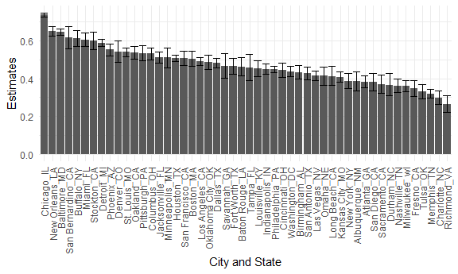
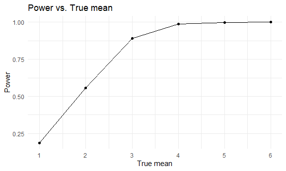
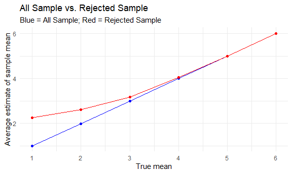

Homework 5
================
2022-11-16

``` r
library(tidyverse)
library(stringr)
library(ggplot2)

knitr::opts_chunk$set(
    echo = TRUE,
    warning = FALSE,
  fig.width = 6,
  fig.asp = .6,
  out.width = "90%"
)
theme_set(theme_minimal() + theme(legend.position = "bottom"))
options(
  ggplot2.continuous.colour = "viridis",
  ggplot2.continuous.fill = "viridis"
)
scale_colour_discrete = scale_colour_viridis_d
scale_fill_discrete = scale_fill_viridis_d
```

# Problem 2

## Load the data

``` r
p2 = read_csv(file = "./data/homicide-data.csv") %>% 
     janitor::clean_names() 

p2$state[p2$city == "Tulsa"] = "OK"
```

Note: I noticed that the state variable for one Tulsa city was coded as
AL, so I changed it here.

## Describe the raw dataset.

This data set is about criminal homicides over the past decade in 50 of
the largest American cities. This data set has 12 variables and 52179
observations. It includes variables: city, disposition, lat, lon,
reported_date, state, uid, victim_age, victim_first, victim_last,
victim_race, victim_sex.

## Data Manipulation

``` r
a = p2 %>% 
  mutate(city_state = str_c(city, "_", state)) %>%
  group_by(city_state) %>% 
  summarise(total_homicides = n())

b = p2 %>% 
  mutate(city_state = str_c(city, "_", state)) %>% 
  filter(disposition != "Closed by arrest") %>% 
  group_by(city_state) %>% 
  summarise(unsolved = n())

new = full_join(a, b, by = "city_state") %>% 
  filter(city_state !=  "Tulsa_AL")
```

## P_test function

``` r
p_test = function(x,n){
  prop.test(x,n) %>% 
  broom::tidy() %>% 
  select(estimate, starts_with("conf"))
}
```

## Baltimore prop.test and Save

``` r
p_test(
  new %>% 
  filter(city_state %in% "Baltimore_MD") %>% 
  pull(unsolved),
  new %>% 
  filter(city_state %in% "Baltimore_MD") %>% 
  pull(total_homicides)
  ) 
```

    ## # A tibble: 1 × 3
    ##   estimate conf.low conf.high
    ##      <dbl>    <dbl>     <dbl>
    ## 1    0.646    0.628     0.663

``` r
save(p_test, file = "./baltimore_test.RData")
```

## For all city

``` r
final = 
  new %>% 
  mutate(summary = map2(.x = new %>% pull(unsolved), 
             .y = new %>% pull(total_homicides), 
             ~p_test(x = .x, n = .y))) %>% 
  unnest()

final
```

    ## # A tibble: 50 × 6
    ##    city_state     total_homicides unsolved estimate conf.low conf.high
    ##    <chr>                    <int>    <int>    <dbl>    <dbl>     <dbl>
    ##  1 Albuquerque_NM             378      146    0.386    0.337     0.438
    ##  2 Atlanta_GA                 973      373    0.383    0.353     0.415
    ##  3 Baltimore_MD              2827     1825    0.646    0.628     0.663
    ##  4 Baton Rouge_LA             424      196    0.462    0.414     0.511
    ##  5 Birmingham_AL              800      347    0.434    0.399     0.469
    ##  6 Boston_MA                  614      310    0.505    0.465     0.545
    ##  7 Buffalo_NY                 521      319    0.612    0.569     0.654
    ##  8 Charlotte_NC               687      206    0.300    0.266     0.336
    ##  9 Chicago_IL                5535     4073    0.736    0.724     0.747
    ## 10 Cincinnati_OH              694      309    0.445    0.408     0.483
    ## # … with 40 more rows

## Plot

``` r
final %>%
  arrange(desc(estimate)) %>% 
  ggplot(aes(x = fct_inorder(city_state), y = estimate)) + 
  geom_bar(stat = 'identity') + geom_errorbar(aes(ymin = conf.low, ymax = conf.high)) + 
  theme(axis.text.x = element_text(angle = 90, vjust = 0.5, hjust = 1)) +
  labs(
    x = "City and State",
    y = "Estimates"
  ) 
```



# Problem 3

## Function

``` r
t_test_sim = function(true_mean) {
  
  sim_data = tibble(
    x = rnorm(30, mean = true_mean, sd = 5)
  )
  
  sim_data %>% 
    t.test() %>% 
    broom::tidy()
}
```

## Map 5000 times when mean = 0

``` r
sim_df_1 = 
  expand_grid(
    true_mean = 0,
    iter = 1:5000
  ) %>% 
  mutate(
    sim_df = map(true_mean, t_test_sim)
  ) %>% 
  unnest(sim_df) %>% 
  select(true_mean, estimate, p.value)
```

## Map 5000 times for mean 1 to 6

``` r
sim_df_2 = 
  expand_grid(
    true_mean = 1:6,
    iter = 1:5000
  ) %>% 
  mutate(
    sim_df = map(true_mean, t_test_sim)
  ) %>% 
  unnest(sim_df) %>% 
  select(true_mean, estimate, p.value)
```

## First Plot

``` r
sim_df_2 %>% 
  filter(p.value < 0.05) %>% 
  group_by(true_mean) %>% 
  summarise(proportions = n() / 5000) %>% 
  ggplot(aes(x = true_mean, y = proportions)) +
  geom_line() + geom_point() +
  scale_x_continuous(breaks = c(1, 2, 3, 4, 5, 6)) +
  labs(
    title = "Power vs. True mean",
    x = "True mean",
    y = "Power"
  )
```


The effect size is the difference between the true mean and mean from
the null (0), as our true mean increase in this example from 1 to 6, the
effective size also increases. Thus, we can conclude that as effective
size increases power (proportion of times the null was rejected)
increases.

## Second Plot

``` r
df1 = sim_df_2 %>% 
  group_by(true_mean) %>% 
  mutate(
    average_estimate = mean(estimate)
  )

df2 = sim_df_2 %>% 
  filter(p.value < 0.05) %>% 
  group_by(true_mean) %>% 
  mutate(
    average_estimate = mean(estimate)
  ) 

ggplot(df1, aes(x = true_mean, y = average_estimate)) +
  geom_line(color = "blue") + geom_point(color = "blue") +
  geom_line(data = df2, color = "red") +
  geom_point(data = df2, color = "red") +
  scale_x_continuous(breaks = c(1, 2, 3, 4, 5, 6)) +
  labs(
    title = "All Sample vs. Rejected Sample",
    subtitle = "Blue = All Sample; Red = Rejected Sample",
    x = "True mean",
    y = "Average estimate of sample mean"
  )
```


As we can see from the plot, only when the then true mean is larger than
4, the sample average of rejected mean is close to the true mean. This
is due to the fact that at larger true mean we have larger power.
