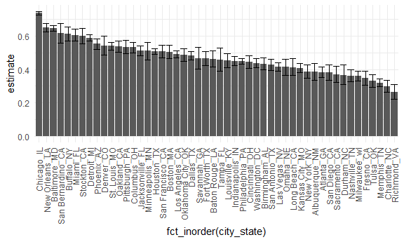

Homework 5
================
2022-11-16

``` r
library(tidyverse)
library(stringr)
library(ggplot2)

knitr::opts_chunk$set(
    echo = TRUE,
    warning = FALSE,
  fig.width = 6,
  fig.asp = .6,
  out.width = "90%"
)
theme_set(theme_minimal() + theme(legend.position = "bottom"))
options(
  ggplot2.continuous.colour = "viridis",
  ggplot2.continuous.fill = "viridis"
)
scale_colour_discrete = scale_colour_viridis_d
scale_fill_discrete = scale_fill_viridis_d
```

# Problem 2

``` r
p2 = read_csv(file = "./data/homicide-data.csv") %>% 
     janitor::clean_names()
```

## Describe the raw dataset.

This data set is about criminal homicides over the past decade in 50 of
the largest American cities. This data set has 12 variables and 52179
observations. It includes variables: city, disposition, lat, lon,
reported_date, state, uid, victim_age, victim_first, victim_last,
victim_race, victim_sex.

## Data Manipulation

``` r
a = p2 %>% 
  mutate(city_state = str_c(city, "_", state)) %>%
  group_by(city_state) %>% 
  summarise(total_homicides = n())

b = p2 %>% 
  mutate(city_state = str_c(city, "_", state)) %>% 
  filter(disposition != "Closed by arrest") %>% 
  group_by(city_state) %>% 
  summarise(unsolved = n())

new = full_join(a, b, by = "city_state") %>% 
  filter(city_state !=  "Tulsa_AL")

p_test = function(x,n){
  prop.test(x,n) %>% 
  broom::tidy() %>% 
  select(estimate, starts_with("conf"))
}
```

kb3246

## MD estimates

``` r
p_test(
  new %>% 
  filter(city_state %in% "Baltimore_MD") %>% 
  pull(unsolved),
  new %>% 
  filter(city_state %in% "Baltimore_MD") %>% 
  pull(total_homicides)
)
```

    ## # A tibble: 1 × 3
    ##   estimate conf.low conf.high
    ##      <dbl>    <dbl>     <dbl>
    ## 1    0.646    0.628     0.663

## All city

``` r
final = 
  new %>% 
  mutate(summary = map2(.x = new %>% pull(unsolved), 
             .y = new %>% pull(total_homicides), 
             ~p_test(x = .x, n = .y))) %>% 
  unnest()
```

## Plot

``` r
final %>%
  arrange(desc(estimate)) %>% 
  ggplot(aes(x = fct_inorder(city_state), y = estimate)) + 
  geom_bar(stat='identity') + geom_errorbar(aes(ymin = conf.low, ymax = conf.high)) + theme(axis.text.x = element_text(angle = 90, vjust = 0.5, hjust=1)) 
```


